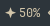
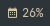

# waybar-claude-usage

A tiny [Waybar](https://github.com/Alexays/Waybar) module that shows how much of
your **Claude subscription** you have left — straight from Anthropic, the same
numbers you see on Claude Code's `/usage` screen.

<p align="left">
  
</p>

Hover for the full breakdown:

```
Claude usage
Session (5h): 70% left  ·  30% used  ·  resets in 3h 15m
Weekly:       28% left  ·  72% used  ·  resets in 2d 13h
```

No token-counting guesswork and no external services — it just reads the real
plan utilisation from the OAuth usage endpoint your `claude` CLI is already
logged in to.

## How it works

It calls `GET https://api.anthropic.com/api/oauth/usage` with the OAuth access
token stored by the Claude Code CLI in `~/.claude/.credentials.json`, and turns
the `five_hour` / `seven_day` utilisation figures into "percent left".

The bar text is the **5-hour session** percentage followed by its **reset
countdown** (e.g. `48% · 2h 56m`); the **weekly** limit is in the tooltip.
**Click the module to toggle** the bar between the two windows —
each uses a different icon so you always know which one you're looking at, and
the tooltip marks the active one with `▸`:

<p align="left">
  
  &nbsp;&nbsp;⟶&nbsp; click &nbsp;⟶&nbsp;&nbsp;
  
</p>

The colour escalates based on whichever limit is closest to running out
(warning ≤ 25% left, critical ≤ 10% left).

> **Note:** this is an undocumented endpoint used by the official tooling, not a
> public API. It may change without warning. The script degrades gracefully
> (serves the last cached response when offline, shows `auth` when the token
> expires).

## Requirements

- `bash`, `curl`, `jq`
- The [Claude Code CLI](https://docs.claude.com/en/docs/claude-code) installed
  and logged in (so `~/.claude/.credentials.json` exists)
- A Nerd Font for the icon glyph `nf-md-star_four_points` (Waybar's default
  font usually has it)

## Install

```bash
git clone <this-repo> ~/.local/share/waybar-claude-usage
chmod +x ~/.local/share/waybar-claude-usage/claude-usage.sh
```

(Or drop `claude-usage.sh` anywhere on your `PATH`.)

## Use it standalone

```bash
./claude-usage.sh --plain
# Claude — session 70% left (resets in 3h 15m) · weekly 28% left (resets in 2d 13h)

./claude-usage.sh --json     # raw API response
./claude-usage.sh            # Waybar JSON (default)
```

## Waybar setup

**`~/.config/waybar/config.jsonc`** — add the module to a `modules-*` list and
define it:

```jsonc
"modules-right": ["custom/claude", /* ... */],

"custom/claude": {
  "exec": "~/.local/share/waybar-claude-usage/claude-usage.sh",
  "return-type": "json",
  "interval": 120,
  "signal": 8,
  "tooltip": true,
  "on-click": "~/.local/share/waybar-claude-usage/claude-usage.sh --toggle",
  "on-click-right": "notify-send -u low 'Claude usage' \"$(~/.local/share/waybar-claude-usage/claude-usage.sh | jq -r .tooltip)\""
}
```

`signal` must match `CLAUDE_USAGE_SIGNAL` (default `8`) — that's how the
click-to-toggle refreshes the module instantly. Left-click toggles
session/weekly; right-click pops a notification with the full breakdown.

**`~/.config/waybar/style.css`** — optional colours:

```css
#custom-claude              { margin: 0 7.5px; }
#custom-claude.warning      { color: #d9a55a; }
#custom-claude.critical     { color: #cc5555; }
#custom-claude.idle         { opacity: 0.5; }
```

Then restart Waybar (`killall -SIGUSR2 waybar`, or on Omarchy:
`omarchy restart waybar`).

## Configuration

Environment variables (set them in the `exec` command if needed):

| Variable               | Default                        | Purpose                              |
| ---------------------- | ------------------------------ | ------------------------------------ |
| `CLAUDE_CREDENTIALS`     | `~/.claude/.credentials.json`  | Path to the Claude CLI credentials       |
| `CLAUDE_USAGE_ICON`      | `nf-md-star_four_points`       | Session-view glyph                       |
| `CLAUDE_USAGE_ICON_WEEK` | `nf-md-calendar_week`          | Weekly-view glyph                        |
| `CLAUDE_USAGE_SIGNAL`    | `8`                            | Waybar RTMIN+N signal used for toggling  |
| `CLAUDE_USAGE_RESET`     | `1`                            | Append reset countdown to the bar (`0` to hide) |

## Privacy

Your OAuth token never leaves your machine except in the request to
`api.anthropic.com` (the same host the `claude` CLI talks to). Nothing is sent
anywhere else, and the only thing written to disk is a usage-response cache in
`$XDG_RUNTIME_DIR` (or `/tmp`).

## License

MIT
# waybar-claude-usage
